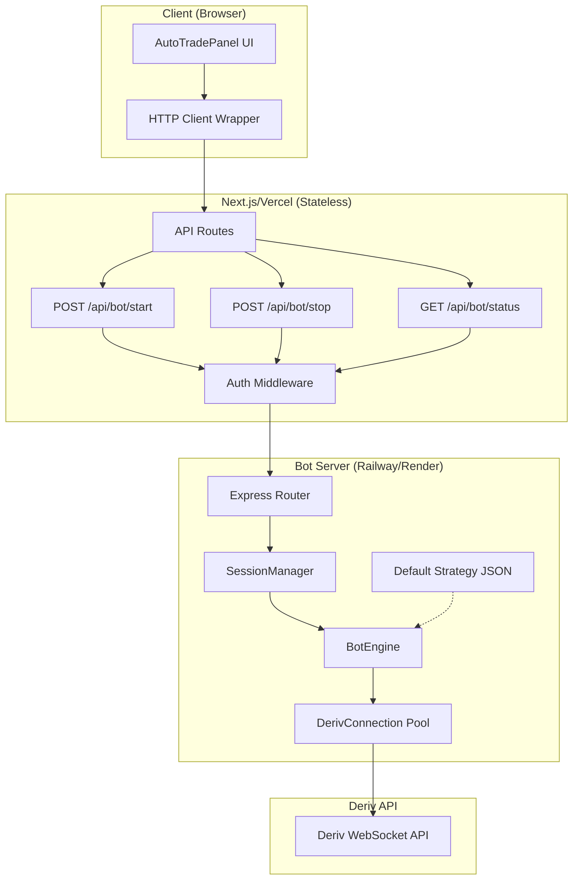
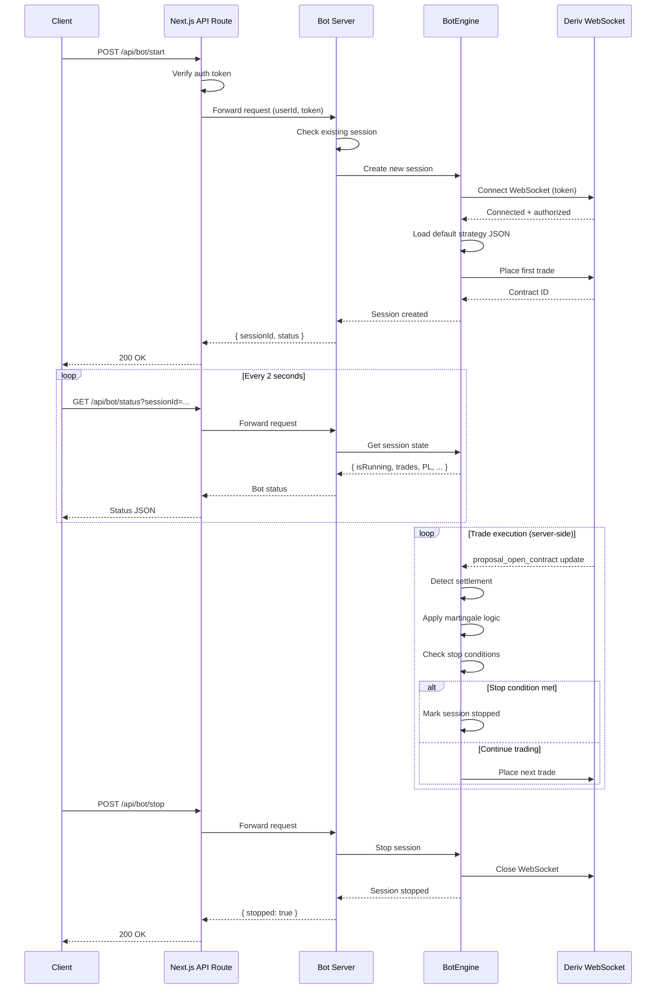

# Design Document: Server-Side Bot Engine (Phase 1)

## Overview

This design moves the Auto Trade bot logic from client-side (`auto-trade-store.ts`) to a server-side engine hosted on Railway/Render, separate from the Next.js/Vercel deployment. The server-side architecture uses JSON-based strategy configurations interpreted by a single BotEngine, maintains session state in-memory, and manages persistent WebSocket connections to Deriv's API. Phase 1 focuses on the default bot working end-to-end without a UI for uploading custom strategies.

**Key Goals:**
- Remove all bot execution logic from the client bundle
- Use JSON config format for strategies (no executable code)
- Single interpreter engine that reads and executes strategy configs
- Persistent server WebSocket connection (not tied to client browser sessions)
- One bot per user enforcement
- Default strategy never exposed to client

## Architecture



## Main Algorithm/Workflow




## Components and Interfaces

### Component 1: BotEngine (Server-Side Interpreter)

**Purpose**: Interprets JSON strategy configs and executes trades via Deriv WebSocket. Single instance per user session.

**Interface**:
```typescript
interface BotEngine {
  startSession(userId: string, config: StrategyConfig, derivToken: string): Promise<string>
  stopSession(sessionId: string, reason?: StopReason): Promise<void>
  getSessionStatus(sessionId: string): BotStatus | null
}
```

**Responsibilities**:
- Parse and validate JSON strategy configs
- Execute trade placement logic per strategy rules
- Apply martingale stake progression on losses
- Monitor contract settlements via WebSocket subscriptions
- Enforce stop conditions (max losses, take profit, stop loss, max stake)
- Maintain session state (current stake, consecutive losses, accumulated P/L)
- Schedule next trade after 2-second inter-trade delay

### Component 2: SessionManager (In-Memory State)

**Purpose**: Manages active bot sessions using an in-memory Map. Enforces one-bot-per-user rule.

**Interface**:
```typescript
interface SessionManager {
  createSession(userId: string, engine: BotEngine): string
  getSession(sessionId: string): BotEngine | null
  getUserSession(userId: string): string | null
  deleteSession(sessionId: string): void
  hasActiveSession(userId: string): boolean
}
```

**Responsibilities**:
- Generate unique session IDs (UUIDs)
- Store sessionId → BotEngine mappings
- Store userId → sessionId reverse index
- Prevent multiple concurrent bots per user
- Clean up completed sessions

### Component 3: DerivConnection (Server WebSocket Manager)

**Purpose**: Manages persistent WebSocket connections to Deriv API. Connection pooling per user (reuse connections across sessions).

**Interface**:
```typescript
interface DerivConnection {
  connect(userId: string, token: string): Promise<WebSocket>
  disconnect(userId: string): Promise<void>
  request<T>(userId: string, payload: Record<string, unknown>): Promise<T>
  subscribe(userId: string, payload: Record<string, unknown>, handler: MessageHandler): number
  unsubscribe(userId: string, subscriptionId: number): void
}
```

**Responsibilities**:
- Open WebSocket to wss://ws.derivws.com/websockets/v3
- Authorize connection using Deriv API token
- Handle reconnection logic with exponential backoff
- Manage subscriptions (balance, portfolio, proposal_open_contract)
- Route incoming messages to registered handlers
- Cleanup connections on session end

### Component 4: API Routes (Next.js → Bot Server Proxy)

**Purpose**: Stateless HTTP endpoints that forward authenticated requests to the bot server.

**Interface**:
```typescript
// POST /api/bot/start
interface StartRequest {
  derivToken: string
}
interface StartResponse {
  sessionId: string
  status: "started" | "error"
  error?: string
}

// POST /api/bot/stop
interface StopRequest {
  sessionId: string
  reason?: StopReason
}
interface StopResponse {
  stopped: boolean
  finalStatus: BotStatus
}

// GET /api/bot/status?sessionId=...
interface StatusResponse extends BotStatus {}
```

**Responsibilities**:
- Verify user authentication (JWT/session token)
- Extract userId from auth context
- Forward requests to bot server via HTTP
- Return responses to client
- Handle bot server errors gracefully

### Component 5: Client HTTP Wrapper

**Purpose**: Replace `auto-trade-store.ts` logic with HTTP calls to API routes. Poll status every 2 seconds.

**Interface**:
```typescript
interface BotClient {
  start(): Promise<{ sessionId: string }>
  stop(sessionId: string): Promise<void>
  getStatus(sessionId: string): Promise<BotStatus>
}
```

**Responsibilities**:
- Call POST /api/bot/start when user clicks "Start Bot"
- Poll GET /api/bot/status every 2 seconds while running
- Update UI state (trades, P/L, current stake, consecutive losses)
- Call POST /api/bot/stop when user clicks "Stop Bot" or component unmounts
- Handle network errors and display to user


## Data Models

### Model 1: StrategyConfig (JSON Format)

```typescript
interface StrategyConfig {
  name: string
  version: string
  description?: string
  
  trade: {
    contractType: ContractType
    symbol: string
    duration: number
    durationUnit: DurationUnit
    barrier?: string
  }
  
  stake: {
    initial: number
    multiplier: number
    maxStake: number
  }
  
  risk: {
    maxConsecutiveLosses: number
    takeProfitAmount: number
    stopLossAmount: number
  }
  
  execution: {
    interTradeDelay: number  // milliseconds
    autoRestart: boolean     // Phase 2 feature
  }
}

type ContractType = "CALL" | "PUT" | "DIGITODD" | "DIGITEVEN" | "DIGITMATCH" | "DIGITDIFF" | "DIGITOVER" | "DIGITUNDER"
type DurationUnit = "t" | "s" | "m" | "h" | "d"
```

**Validation Rules**:
- `stake.initial` > 0 and <= 100
- `stake.multiplier` >= 1 and <= 10
- `stake.maxStake` >= `stake.initial`
- `risk.maxConsecutiveLosses` >= 1 and <= 20
- `risk.takeProfitAmount` > 0
- `risk.stopLossAmount` > 0
- `execution.interTradeDelay` >= 2000 (minimum 2 seconds)

**Default Strategy JSON**:
```json
{
  "name": "Default Martingale",
  "version": "1.0.0",
  "description": "Conservative martingale strategy for Even/Odd digits",
  "trade": {
    "contractType": "DIGITEVEN",
    "symbol": "R_100",
    "duration": 1,
    "durationUnit": "t",
    "barrier": ""
  },
  "stake": {
    "initial": 0.35,
    "multiplier": 2,
    "maxStake": 10
  },
  "risk": {
    "maxConsecutiveLosses": 5,
    "takeProfitAmount": 5,
    "stopLossAmount": 10
  },
  "execution": {
    "interTradeDelay": 2000,
    "autoRestart": false
  }
}
```

### Model 2: BotState (Session State)

```typescript
interface BotState {
  sessionId: string
  userId: string
  isRunning: boolean
  currentStake: number
  consecutiveLosses: number
  accumulatedPL: number
  pendingContractId: number | null
  stopReason: StopReason | null
  error: string | null
  currency: string | null
  startTime: number
  lastTradeTime: number | null
}
```

### Model 3: TradeRecord

```typescript
interface TradeRecord {
  id: string
  contractId: number
  contractType: string
  symbol: string
  stake: number
  result: "win" | "loss" | "pending"
  payout: number
  profit: number
  timestamp: number
}
```

### Model 4: BotStatus (API Response)

```typescript
interface BotStatus {
  sessionId: string
  isRunning: boolean
  currentStake: number
  consecutiveLosses: number
  accumulatedPL: number
  stopReason: StopReason | null
  error: string | null
  trades: TradeRecord[]
  uptime: number  // milliseconds since session start
}

type StopReason = "max_losses" | "take_profit" | "stop_loss" | "max_stake" | "manual" | null
```


## Algorithmic Pseudocode

### Algorithm 1: Start Bot Session

```pascal
ALGORITHM startBotSession(userId, derivToken)
INPUT: userId (string), derivToken (string)
OUTPUT: sessionId (string) or error

PRECONDITIONS:
  - userId is non-empty string
  - derivToken is valid Deriv API token
  - SessionManager is initialized

POSTCONDITIONS:
  - If successful: new session created, WebSocket connected, first trade placed
  - If user has active session: error returned
  - Session state stored in SessionManager

BEGIN
  // Step 1: Enforce one-bot-per-user rule
  IF SessionManager.hasActiveSession(userId) THEN
    THROW Error("User already has an active bot session")
  END IF
  
  // Step 2: Load default strategy config
  config ← loadDefaultStrategyConfig()
  
  // Step 3: Validate strategy config
  validationResult ← validateStrategyConfig(config)
  IF validationResult.isInvalid THEN
    THROW Error(validationResult.message)
  END IF
  
  // Step 4: Create WebSocket connection
  wsConnection ← DerivConnection.connect(userId, derivToken)
  AWAIT wsConnection.authorize()
  
  // Step 5: Initialize bot state
  sessionId ← generateUUID()
  botState ← {
    sessionId: sessionId,
    userId: userId,
    isRunning: true,
    currentStake: config.stake.initial,
    consecutiveLosses: 0,
    accumulatedPL: 0,
    pendingContractId: null,
    stopReason: null,
    error: null,
    currency: wsConnection.currency,
    startTime: now(),
    lastTradeTime: null
  }
  
  // Step 6: Create and register session
  engine ← new BotEngine(botState, config, wsConnection)
  SessionManager.createSession(userId, engine)
  
  // Step 7: Subscribe to portfolio updates
  subscriptionId ← wsConnection.subscribe(userId, {
    proposal_open_contract: 1,
    subscribe: 1
  }, engine.handleContractUpdate)
  
  // Step 8: Place first trade
  AWAIT engine.placeTrade(config.stake.initial)
  
  RETURN sessionId
END

LOOP INVARIANTS:
  - At most one active session per userId
  - All active sessions have valid WebSocket connections
  - SessionManager state remains consistent
```

### Algorithm 2: Place Trade

```pascal
ALGORITHM placeTrade(stake)
INPUT: stake (number)
OUTPUT: contractId (number) or error

PRECONDITIONS:
  - WebSocket connection is open and authorized
  - stake > 0 and stake <= config.stake.maxStake
  - No pending contract (pendingContractId === null)
  - Session is running (isRunning === true)

POSTCONDITIONS:
  - If successful: contract purchased, pendingContractId set, trade recorded
  - If failed: error set, session stopped
  - Trade record added to history

BEGIN
  // Step 1: Validate preconditions
  IF NOT isRunning THEN
    RETURN null
  END IF
  
  IF pendingContractId IS NOT null THEN
    RETURN null  // Previous contract still pending
  END IF
  
  // Step 2: Build proposal request
  proposalPayload ← {
    proposal: 1,
    amount: round2(stake),
    basis: "stake",
    contract_type: config.trade.contractType,
    currency: botState.currency,
    duration: config.trade.duration,
    duration_unit: config.trade.durationUnit,
    underlying_symbol: config.trade.symbol
  }
  
  IF config.trade.barrier IS NOT empty THEN
    proposalPayload.barrier ← config.trade.barrier
  END IF
  
  // Step 3: Get proposal
  TRY
    proposalResponse ← AWAIT wsConnection.request(userId, proposalPayload)
    
    IF proposalResponse.error THEN
      THROW Error(proposalResponse.error.message)
    END IF
    
    proposalId ← proposalResponse.proposal.id
    askPrice ← proposalResponse.proposal.ask_price
    payout ← proposalResponse.proposal.payout
    
  CATCH error
    botState.error ← error.message
    botState.isRunning ← false
    RETURN null
  END TRY
  
  // Step 4: Purchase contract
  TRY
    buyResponse ← AWAIT wsConnection.request(userId, {
      buy: proposalId,
      price: askPrice
    })
    
    IF buyResponse.error THEN
      THROW Error(buyResponse.error.message)
    END IF
    
    contractId ← buyResponse.buy.contract_id
    buyPrice ← buyResponse.buy.buy_price
    
  CATCH error
    botState.error ← error.message
    botState.isRunning ← false
    RETURN null
  END TRY
  
  // Step 5: Record trade
  botState.pendingContractId ← contractId
  botState.currentStake ← round2(stake)
  botState.lastTradeTime ← now()
  
  tradeRecord ← {
    id: generateTradeId(),
    contractId: contractId,
    contractType: config.trade.contractType,
    symbol: config.trade.symbol,
    stake: round2(stake),
    result: "pending",
    payout: payout,
    profit: 0,
    timestamp: now()
  }
  
  botState.trades.push(tradeRecord)
  
  RETURN contractId
END

LOOP INVARIANTS:
  - Only one pending contract at a time per session
  - All trade records have unique IDs
  - Total trades count never decreases
```


### Algorithm 3: Handle Contract Settlement

```pascal
ALGORITHM handleContractSettlement(contractId, status, profit)
INPUT: contractId (number), status (string), profit (number)
OUTPUT: void (updates botState, may trigger next trade or stop)

PRECONDITIONS:
  - contractId === botState.pendingContractId
  - status IN ["won", "lost"]
  - Session is running
  - Trade record exists for contractId

POSTCONDITIONS:
  - Trade record updated with final result and profit
  - botState.accumulatedPL updated
  - botState.consecutiveLosses updated
  - Next stake calculated
  - Stop conditions checked
  - If continuing: next trade scheduled after interTradeDelay
  - If stopping: session marked stopped with reason

BEGIN
  // Step 1: Validate contract matches pending
  IF contractId NOT EQUALS botState.pendingContractId THEN
    RETURN  // Ignore outdated or wrong contract
  END IF
  
  // Step 2: Clear pending state immediately
  botState.pendingContractId ← null
  
  // Step 3: Determine win/loss
  isWin ← (status EQUALS "won")
  safeProfit ← parseFloat(profit)
  IF isNaN(safeProfit) THEN
    safeProfit ← 0
  END IF
  
  // Step 4: Update trade record
  FOR EACH trade IN botState.trades DO
    IF trade.contractId EQUALS contractId THEN
      trade.result ← isWin ? "win" : "loss"
      trade.profit ← round2(safeProfit)
      BREAK
    END IF
  END FOR
  
  // Step 5: Update session metrics
  newPL ← round2(botState.accumulatedPL + safeProfit)
  botState.accumulatedPL ← newPL
  
  IF isWin THEN
    botState.consecutiveLosses ← 0
    nextStake ← config.stake.initial
  ELSE
    botState.consecutiveLosses ← botState.consecutiveLosses + 1
    nextStake ← round2(botState.currentStake * config.stake.multiplier)
  END IF
  
  // Step 6: Check stop conditions
  IF botState.consecutiveLosses >= config.risk.maxConsecutiveLosses THEN
    botState.isRunning ← false
    botState.stopReason ← "max_losses"
    RETURN
  END IF
  
  IF newPL >= config.risk.takeProfitAmount THEN
    botState.isRunning ← false
    botState.stopReason ← "take_profit"
    RETURN
  END IF
  
  IF newPL <= -config.risk.stopLossAmount THEN
    botState.isRunning ← false
    botState.stopReason ← "stop_loss"
    RETURN
  END IF
  
  IF nextStake > config.stake.maxStake THEN
    botState.isRunning ← false
    botState.stopReason ← "max_stake"
    RETURN
  END IF
  
  // Step 7: Schedule next trade
  botState.currentStake ← nextStake
  
  scheduleTimer(config.execution.interTradeDelay, FUNCTION()
    IF botState.isRunning THEN
      AWAIT placeTrade(nextStake)
    END IF
  END FUNCTION)
END

LOOP INVARIANTS:
  - accumulatedPL accurately reflects sum of all settled trade profits
  - consecutiveLosses accurately counts consecutive losses since last win
  - Only one timer scheduled at a time
  - Stop conditions mutually exclusive (only one stopReason set)
```

### Algorithm 4: Stop Bot Session

```pascal
ALGORITHM stopBotSession(sessionId, reason)
INPUT: sessionId (string), reason (StopReason, default "manual")
OUTPUT: finalStatus (BotStatus)

PRECONDITIONS:
  - sessionId exists in SessionManager
  - Session may be running or already stopped

POSTCONDITIONS:
  - Session marked as stopped
  - WebSocket connection closed
  - Session removed from SessionManager
  - Final status returned

BEGIN
  // Step 1: Retrieve session
  engine ← SessionManager.getSession(sessionId)
  IF engine IS null THEN
    THROW Error("Session not found")
  END IF
  
  // Step 2: Mark session stopped
  IF engine.botState.isRunning THEN
    engine.botState.isRunning ← false
    engine.botState.stopReason ← reason
  END IF
  
  // Step 3: Cancel any scheduled timers
  IF engine.nextTradeTimer IS NOT null THEN
    clearTimeout(engine.nextTradeTimer)
    engine.nextTradeTimer ← null
  END IF
  
  // Step 4: Unsubscribe from WebSocket
  FOR EACH subscriptionId IN engine.activeSubscriptions DO
    wsConnection.unsubscribe(engine.userId, subscriptionId)
  END FOR
  
  // Step 5: Close WebSocket connection
  DerivConnection.disconnect(engine.userId)
  
  // Step 6: Build final status
  finalStatus ← {
    sessionId: engine.botState.sessionId,
    isRunning: false,
    currentStake: engine.botState.currentStake,
    consecutiveLosses: engine.botState.consecutiveLosses,
    accumulatedPL: engine.botState.accumulatedPL,
    stopReason: engine.botState.stopReason,
    error: engine.botState.error,
    trades: engine.botState.trades,
    uptime: now() - engine.botState.startTime
  }
  
  // Step 7: Remove session from manager
  SessionManager.deleteSession(sessionId)
  
  RETURN finalStatus
END
```


## Key Functions with Formal Specifications

### Function 1: validateStrategyConfig()

```typescript
function validateStrategyConfig(config: StrategyConfig): { isValid: boolean; message?: string }
```

**Preconditions:**
- `config` is a well-formed object with all required fields

**Postconditions:**
- Returns `{ isValid: true }` if all validation rules pass
- Returns `{ isValid: false, message: string }` with descriptive error if validation fails
- No mutations to input config

**Validation Rules:**
1. `config.stake.initial` > 0 AND <= 100
2. `config.stake.multiplier` >= 1 AND <= 10
3. `config.stake.maxStake` >= `config.stake.initial`
4. `config.risk.maxConsecutiveLosses` >= 1 AND <= 20
5. `config.risk.takeProfitAmount` > 0
6. `config.risk.stopLossAmount` > 0
7. `config.execution.interTradeDelay` >= 2000
8. `config.trade.contractType` IN valid ContractType values
9. `config.trade.durationUnit` IN ["t", "s", "m", "h", "d"]

### Function 2: loadDefaultStrategyConfig()

```typescript
function loadDefaultStrategyConfig(): StrategyConfig
```

**Preconditions:**
- Default strategy JSON file exists on server
- JSON is well-formed and valid

**Postconditions:**
- Returns parsed StrategyConfig object
- Config passes validateStrategyConfig()
- No side effects

### Function 3: generateSessionId()

```typescript
function generateSessionId(): string
```

**Preconditions:**
- None

**Postconditions:**
- Returns unique UUID v4 string
- Probability of collision negligible (< 10^-15)
- Format: "xxxxxxxx-xxxx-4xxx-yxxx-xxxxxxxxxxxx"

### Function 4: round2()

```typescript
function round2(n: number): number
```

**Preconditions:**
- `n` is a finite number

**Postconditions:**
- Returns `n` rounded to 2 decimal places
- Uses banker's rounding (round half to even)
- Precision suitable for currency calculations

### Function 5: calculateNextStake()

```typescript
function calculateNextStake(
  currentStake: number, 
  isWin: boolean, 
  multiplier: number, 
  baseStake: number
): number
```

**Preconditions:**
- `currentStake` > 0
- `multiplier` >= 1
- `baseStake` > 0

**Postconditions:**
- If `isWin === true`: returns `baseStake`
- If `isWin === false`: returns `round2(currentStake * multiplier)`
- Result always >= `baseStake`

**Loop Invariants:**
N/A (no loops)


## Example Usage

### Example 1: Client Starting Bot

```typescript
// Client-side code (replacement for auto-trade-store.ts)
import { botClient } from "@/lib/bot-client"

async function startBot() {
  try {
    const { sessionId } = await botClient.start()
    
    // Start polling for status
    const pollInterval = setInterval(async () => {
      const status = await botClient.getStatus(sessionId)
      
      // Update UI state
      setIsRunning(status.isRunning)
      setCurrentStake(status.currentStake)
      setAccumulatedPL(status.accumulatedPL)
      setTrades(status.trades)
      
      // Stop polling if bot stopped
      if (!status.isRunning) {
        clearInterval(pollInterval)
        setStopReason(status.stopReason)
      }
    }, 2000)
    
  } catch (error) {
    setError(error.message)
  }
}
```

### Example 2: Next.js API Route (Start)

```typescript
// app/api/bot/start/route.ts
import { NextRequest, NextResponse } from "next/server"
import { verifyAuth } from "@/lib/auth"

export async function POST(req: NextRequest) {
  // Verify authentication
  const auth = await verifyAuth(req)
  if (!auth.isValid) {
    return NextResponse.json({ error: "Unauthorized" }, { status: 401 })
  }
  
  // Extract Deriv token from request
  const { derivToken } = await req.json()
  
  // Forward to bot server
  const response = await fetch(`${process.env.BOT_SERVER_URL}/sessions/start`, {
    method: "POST",
    headers: { "Content-Type": "application/json" },
    body: JSON.stringify({
      userId: auth.userId,
      derivToken: derivToken
    })
  })
  
  if (!response.ok) {
    const error = await response.json()
    return NextResponse.json({ error: error.message }, { status: 500 })
  }
  
  const data = await response.json()
  return NextResponse.json({ sessionId: data.sessionId })
}
```

### Example 3: Bot Server (Express)

```typescript
// bot-server/routes/sessions.ts
import express from "express"
import { SessionManager } from "../session-manager"
import { BotEngine } from "../bot-engine"

const router = express.Router()

router.post("/start", async (req, res) => {
  const { userId, derivToken } = req.body
  
  try {
    // Check for existing session
    if (SessionManager.hasActiveSession(userId)) {
      return res.status(400).json({ 
        error: "User already has an active bot session" 
      })
    }
    
    // Start new session
    const sessionId = await BotEngine.startSession(userId, derivToken)
    
    return res.json({ 
      sessionId,
      status: "started" 
    })
    
  } catch (error) {
    return res.status(500).json({ 
      error: error.message 
    })
  }
})

router.post("/stop", async (req, res) => {
  const { sessionId, reason } = req.body
  
  try {
    const finalStatus = await BotEngine.stopSession(sessionId, reason)
    return res.json({ stopped: true, finalStatus })
    
  } catch (error) {
    return res.status(500).json({ error: error.message })
  }
})

router.get("/status", async (req, res) => {
  const { sessionId } = req.query
  
  try {
    const status = SessionManager.getSession(sessionId)?.getStatus()
    
    if (!status) {
      return res.status(404).json({ error: "Session not found" })
    }
    
    return res.json(status)
    
  } catch (error) {
    return res.status(500).json({ error: error.message })
  }
})

export default router
```


## Correctness Properties

### Property 1: One Bot Per User
**Universal Quantification:**
```
∀ userId, ∀ time t: 
  |{ sessionId | SessionManager.sessions[sessionId].userId === userId ∧ sessions[sessionId].isRunning === true }| ≤ 1
```
**English:** At any given time, a user has at most one running bot session.

**Validates: Requirements 1.3, 16.2, 16.3, 16.5**

**Test Strategy:** Attempt concurrent start requests for same user, verify second request rejected.

### Property 2: Stake Progression Correctness
**Universal Quantification:**
```
∀ trade[i] where trade[i].result === "loss":
  trade[i+1].stake === min(round2(trade[i].stake * config.stake.multiplier), config.stake.maxStake)

∀ trade[i] where trade[i].result === "win":
  trade[i+1].stake === config.stake.initial
```
**English:** After a loss, next stake is current stake times multiplier (capped at maxStake). After a win, next stake resets to initial stake.

**Validates: Requirements 5.1, 5.2, 5.3**

**Test Strategy:** Property-based test with randomized win/loss sequences, verify stake calculations.

### Property 3: Stop Condition Enforcement
**Universal Quantification:**
```
∀ session:
  (session.consecutiveLosses >= config.risk.maxConsecutiveLosses) ⟹ (session.isRunning === false ∧ session.stopReason === "max_losses")
  ∧
  (session.accumulatedPL >= config.risk.takeProfitAmount) ⟹ (session.isRunning === false ∧ session.stopReason === "take_profit")
  ∧
  (session.accumulatedPL <= -config.risk.stopLossAmount) ⟹ (session.isRunning === false ∧ session.stopReason === "stop_loss")
  ∧
  (session.currentStake > config.stake.maxStake) ⟹ (session.isRunning === false ∧ session.stopReason === "max_stake")
```
**English:** When any stop condition is met, the session stops immediately with the corresponding stop reason.

**Validates: Requirements 7.1, 7.2, 7.3, 7.4, 7.5, 7.6**

**Test Strategy:** Unit tests for each stop condition, verify session stops and reason is correct.

### Property 4: P/L Accounting Accuracy
**Universal Quantification:**
```
∀ session, ∀ time t:
  session.accumulatedPL === Σ(trade.profit for trade in session.trades where trade.result !== "pending")
```
**English:** Accumulated P/L always equals the sum of all settled trade profits.

**Validates: Requirements 6.1, 6.2, 6.3, 6.4**

**Test Strategy:** Property-based test with random trade sequences, verify sum invariant.

### Property 5: No Concurrent Pending Contracts
**Universal Quantification:**
```
∀ session, ∀ time t:
  (session.pendingContractId !== null) ⟹ (no new trade placed until settlement)
```
**English:** A session never places a new trade while a previous contract is still pending.

**Validates: Requirements 4.8**

**Test Strategy:** Concurrency test attempting overlapping placeTrade calls, verify rejections.

### Property 6: Session Cleanup Idempotence
**Universal Quantification:**
```
∀ sessionId:
  stopBotSession(sessionId, reason) ∘ stopBotSession(sessionId, reason) ≡ stopBotSession(sessionId, reason)
```
**English:** Calling stopBotSession multiple times has the same effect as calling it once (idempotent).

**Validates: Requirements 15.5, 15.6**

**Test Strategy:** Call stop twice on same session, verify no errors and same final state.

### Property 7: Config Immutability During Session
**Universal Quantification:**
```
∀ session:
  session.config === immutable throughout session.startTime to session.endTime
```
**English:** Strategy configuration remains unchanged for the entire session lifetime.

**Validates: Requirements 3.11, 22.1, 22.2**

**Test Strategy:** Verify config object frozen/immutable after session creation.


## Error Handling

### Error Scenario 1: User Already Has Active Session

**Condition:** User calls POST /api/bot/start while already having a running bot session

**Response:** 
- Return 400 Bad Request
- Error message: "User already has an active bot session"
- Do not create new session

**Recovery:** 
- Client displays error to user
- User must stop existing session before starting new one
- Optionally: client auto-fetches existing session status and resumes UI

### Error Scenario 2: Deriv WebSocket Connection Fails

**Condition:** 
- Cannot connect to wss://ws.derivws.com/websockets/v3
- Authorization fails with invalid token
- Connection drops mid-session

**Response:**
- During start: Return 500 Internal Server Error with message "Failed to connect to Deriv API"
- During session: Mark session stopped with error field set
- Log detailed error server-side

**Recovery:**
- Client displays connection error to user
- Server implements exponential backoff reconnection (max 5 attempts)
- If reconnection succeeds: resume from last known state (check pending contract via proposal_open_contract API)
- If reconnection fails: stop session with error

### Error Scenario 3: Trade Placement Fails

**Condition:**
- Proposal request returns error (invalid symbol, duration, etc.)
- Buy request fails (insufficient balance, contract not available)

**Response:**
- Stop session immediately
- Set botState.error with API error message
- Set botState.stopReason = null (error is distinct from normal stop reasons)

**Recovery:**
- Client displays error to user
- User reviews error message and configuration
- User manually stops session (already stopped, but cleans up UI state)

### Error Scenario 4: WebSocket Message Parsing Error

**Condition:** Malformed JSON or unexpected message structure from Deriv API

**Response:**
- Log error server-side with full message payload
- Ignore malformed message (do not crash session)
- Continue waiting for valid settlement message

**Recovery:**
- Session continues running
- If contract remains pending beyond expected duration: implement timeout (e.g., 5 minutes)
- After timeout: query proposal_open_contract directly to force settlement check

### Error Scenario 5: Bot Server Unreachable

**Condition:** Next.js API route cannot reach bot server (network partition, server crash)

**Response:**
- Return 503 Service Unavailable
- Error message: "Bot service temporarily unavailable"

**Recovery:**
- Client displays service unavailable message
- Client retries with exponential backoff (3 attempts, max 10 seconds)
- If persistent: display "Service down" banner, ask user to try again later

### Error Scenario 6: Session Not Found on Status Poll

**Condition:** Client polls GET /api/bot/status for sessionId that doesn't exist (expired, server restart)

**Response:**
- Return 404 Not Found
- Error message: "Session not found or expired"

**Recovery:**
- Client stops polling
- Display "Session expired" message to user
- Reset UI to idle state
- User can start new session


## Testing Strategy

### Unit Testing Approach

**Testing Library:** Jest (Node.js)

**Key Test Suites:**

1. **validateStrategyConfig()**
   - Valid config passes validation
   - Invalid stake values rejected (negative, zero, too high)
   - Invalid multiplier rejected (< 1, > 10)
   - Invalid risk limits rejected
   - Invalid contract types rejected

2. **calculateNextStake()**
   - Win resets stake to baseStake
   - Loss multiplies stake correctly
   - Result never exceeds maxStake
   - Rounding to 2 decimals

3. **SessionManager**
   - Create session returns unique sessionId
   - Duplicate session for same user rejected
   - Get session by sessionId works
   - Get session by userId works
   - Delete session removes from both indexes

4. **BotEngine.placeTrade()**
   - Builds correct proposal payload
   - Handles proposal errors gracefully
   - Handles buy errors gracefully
   - Records trade in history
   - Sets pendingContractId

5. **BotEngine.handleSettlement()**
   - Ignores wrong contractId
   - Clears pendingContractId immediately
   - Updates trade record correctly
   - Calculates P/L correctly
   - Checks all stop conditions
   - Schedules next trade if continuing

**Coverage Goal:** 90%+ line coverage, 100% branch coverage for critical paths

### Property-Based Testing Approach

**Property Test Library:** fast-check (TypeScript)

**Property Tests:**

1. **Stake Progression Property**
   ```typescript
   fc.assert(
     fc.property(
       fc.array(fc.boolean()), // Random win/loss sequence
       fc.float({ min: 0.1, max: 10 }), // Base stake
       fc.float({ min: 1, max: 10 }), // Multiplier
       (winLossSeq, baseStake, multiplier) => {
         let stake = baseStake
         for (const isWin of winLossSeq) {
           const nextStake = calculateNextStake(stake, isWin, multiplier, baseStake)
           if (isWin) {
             expect(nextStake).toBe(baseStake)
           } else {
             expect(nextStake).toBeCloseTo(stake * multiplier, 2)
           }
           stake = nextStake
         }
       }
     )
   )
   ```

2. **P/L Accounting Property**
   ```typescript
   fc.assert(
     fc.property(
       fc.array(fc.record({
         stake: fc.float({ min: 0.35, max: 100 }),
         isWin: fc.boolean(),
         payout: fc.float({ min: 0, max: 200 })
       })),
       (trades) => {
         const engine = new MockBotEngine()
         let expectedPL = 0
         
         for (const trade of trades) {
           const profit = trade.isWin 
             ? trade.payout - trade.stake 
             : -trade.stake
           expectedPL += profit
           engine.recordTrade({ ...trade, profit })
         }
         
         expect(engine.botState.accumulatedPL).toBeCloseTo(expectedPL, 2)
       }
     )
   )
   ```

3. **Stop Condition Property**
   - Generate random trade sequences
   - Verify session stops exactly when stop condition first met
   - Verify correct stopReason set

4. **Idempotence Property (Stop Session)**
   ```typescript
   fc.assert(
     fc.property(
       fc.string(), // sessionId
       (sessionId) => {
         const engine = createMockEngine(sessionId)
         const result1 = stopBotSession(sessionId, "manual")
         const result2 = stopBotSession(sessionId, "manual")
         expect(result1).toEqual(result2)
       }
     )
   )
   ```

### Integration Testing Approach

**Testing Library:** Supertest (Express.js API testing)

**Integration Tests:**

1. **End-to-End Session Flow**
   - Start session → Poll status → Stop session
   - Verify WebSocket connection opened/closed
   - Verify trade placement and settlement
   - Verify final P/L accurate

2. **Concurrent Start Requests**
   - Two simultaneous POST /api/bot/start for same user
   - Verify one succeeds, one returns 400

3. **Status Polling During Active Session**
   - Start session
   - Poll status 10 times over 20 seconds
   - Verify consistent state evolution
   - Verify trade history grows

4. **Network Failure Recovery**
   - Start session
   - Simulate WebSocket disconnect
   - Verify reconnection attempt
   - Verify session resumes or stops gracefully

5. **Bot Server Restart Simulation**
   - Start session
   - Kill and restart bot server
   - Verify in-memory sessions lost
   - Verify client handles 404 on next status poll

**Test Environment:** Mock Deriv WebSocket server for deterministic responses


## Performance Considerations

### Latency Requirements

**Trade Placement Latency:**
- Target: < 500ms from settlement detection to next trade placement
- Breakdown: 100ms settlement processing + 2000ms inter-trade delay + 400ms WebSocket round-trip
- Critical path: Minimize processing in handleSettlement() algorithm

**Status Poll Response Time:**
- Target: < 200ms for GET /api/bot/status
- Implementation: In-memory Map lookup (O(1)), no database queries
- Optimization: Cache serialized BotStatus objects, update only on state changes

**WebSocket Message Processing:**
- Target: < 50ms per message
- Approach: Event-driven architecture, async handlers
- Avoid blocking operations in message handlers

### Scalability Limits

**Concurrent Users:**
- Target: 100 concurrent bot sessions per server instance
- Bottleneck: WebSocket connections (typical limit ~10K per server)
- Scaling strategy: Horizontal scaling with load balancer

**Memory Usage:**
- Per session: ~500KB (state + trade history for 100 trades)
- 100 sessions = ~50MB
- Server instance: 512MB RAM sufficient for initial deployment

**CPU Usage:**
- Per session: ~1% CPU during active trading
- Spike during settlement detection + next trade placement
- 100 sessions = ~100% single core (distribute across cores)

### Optimization Strategies

**1. Connection Pooling:**
- Reuse WebSocket connections across sessions for same user
- Avoid reconnection overhead on session restart
- Implement connection timeout after 5 minutes of inactivity

**2. Batch Status Polling:**
- If multiple clients poll same sessionId: return cached response
- Invalidate cache on state updates
- Reduces redundant serialization

**3. Trade History Pruning:**
- Keep last 100 trades in memory
- Archive older trades to database (future enhancement)
- Prevents unbounded memory growth

**4. Heartbeat Optimization:**
- Single heartbeat interval for all sessions (shared timer)
- Reduces timer overhead from O(n) to O(1)

## Security Considerations

### Authentication & Authorization

**Token Handling:**
- Deriv API tokens never stored persistently
- Tokens passed from client to server per-request
- Server validates token on session start only
- WebSocket auth via Deriv's OTP mechanism

**Session Security:**
- SessionId is UUID (non-guessable)
- userId → sessionId mapping enforces ownership
- API routes verify userId from auth context matches session owner

**API Route Protection:**
- All /api/bot/* routes require valid JWT/session token
- Middleware extracts userId from auth context
- Bot server trusts Next.js API routes (internal network)

### Input Validation

**Strategy Config Validation:**
- Validate all numeric bounds (stake, risk limits)
- Sanitize contract type enum values
- Prevent injection via barrier strings (Deriv API validates barrier format)

**SessionId Validation:**
- Validate UUID format before lookup
- Prevent NoSQL injection (in-memory Map, not applicable)

**UserId Validation:**
- Alphanumeric + underscores only
- Max length 100 characters

### Secrets Management

**Environment Variables:**
```bash
BOT_SERVER_URL=https://bot-server.railway.app
DERIV_APP_ID=12345
JWT_SECRET=<random-256-bit-key>
```

**Never Log:**
- Deriv API tokens (redact in logs)
- User balances (PII)
- Full strategy configs sent to client

### Rate Limiting

**API Endpoints:**
- POST /api/bot/start: 5 requests/minute per user
- GET /api/bot/status: 60 requests/minute per user (30/sec polling)
- POST /api/bot/stop: 10 requests/minute per user

**Implementation:** Express-rate-limit middleware

**Deriv API Rate Limits:**
- Respect Deriv's WebSocket rate limits (documented as 100 req/sec)
- Inter-trade delay (2s minimum) naturally throttles trade placement

### Denial of Service Protection

**Session Limits:**
- Max 1 session per user (enforced)
- Max 100 concurrent sessions per server instance
- Reject new sessions if limit reached

**WebSocket Flooding:**
- Ignore unexpected messages (invalid contractId)
- Rate limit subscription requests
- Disconnect abusive connections after 3 warnings

## Dependencies

### Server-Side (Bot Server)

**Core Dependencies:**
- `express` ^4.18.2 - HTTP server framework
- `ws` ^8.14.2 - WebSocket client library
- `uuid` ^9.0.0 - Session ID generation
- `dotenv` ^16.3.1 - Environment variable management

**Dev Dependencies:**
- `typescript` ^5.2.2
- `@types/node` ^20.8.0
- `@types/express` ^4.17.20
- `@types/ws` ^8.5.8
- `jest` ^29.7.0 - Unit testing
- `fast-check` ^3.13.2 - Property-based testing
- `supertest` ^6.3.3 - Integration testing
- `ts-node` ^10.9.1 - TypeScript execution

### Client-Side (Next.js)

**New Dependencies:**
- None (remove `zustand` from client-side bot store)

**Modified Files:**
- `components/autotrade/hooks/use-auto-trade.ts` - Replace Zustand with HTTP calls
- `lib/bot-client.ts` - New HTTP wrapper
- Remove `lib/auto-trade-store.ts` - Delete entire file

### Infrastructure

**Hosting:**
- Bot Server: Railway (persistent process) or Render (background worker)
- Next.js: Vercel (existing)

**Networking:**
- Railway → Deriv WebSocket: Outbound HTTPS/WSS allowed
- Vercel → Railway: Internal HTTP (authenticated via shared secret or JWT)
- Client → Vercel: HTTPS (existing)

**Environment:**
- Node.js 18+ LTS
- Memory: 512MB minimum
- Storage: None (in-memory sessions)

